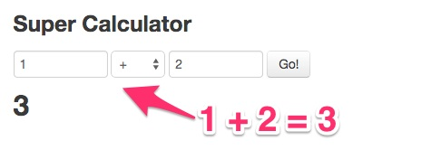

## 受け入れテストツール
## Protractor / Angular
## でスクレイピング

---

## Protractorって何？

- 日本語で「分度器」
- AngularJSに付属している受け入れテストツール
- AngularJSを使ってない普通のサイトでも使用可能
- 内部でSeleniumを使用

---

## どんなふうに使うの？

---

## こんなサイトがあるとします

足し算をするサイト

---

## 受け入れテストは、こんな感じ

- 1つめのボックスに「1」を入力し、
- 2つめのボックスに「2」を入力すると・・・
- 「3」が出力されるはず 

---

<pre style="background:#0c1021;color:#f8f8f8">describe('AngularJSホームページ', function() {
  it('1と2を加える', function() {
    // 足し算をするサイト
    browser.get('http://juliemr.github.io/protractor-demo/');
    element(by.model('first')).sendKeys(1);
    element(by.model('second')).sendKeys(2);

    element(by.id('gobutton')).click();

    // 1と2を足したら結果は3になるはず、というテスト
    expect(element(by.binding('latest')).getText()).toEqual('3');
  });
});
</pre>

---

- このテストコードで実際にブラウザが起ち上がってテストをします
- ヘッドレスではないので、テストの過程がわかりやすいです

## このテストツールを使って
## スクレイピングしてしまう、
## というのが今回の発表内容です

---

## 目的

とある商工会議所の事業所検索ページから、

**全ての事業所の情報**を引き出す

---

<pre style="background:#0c1021;color:#f8f8f8">  it('目標業種のページへ行く', function () {

    // 商工会議所の事業所検索ページに行く
    browser.get('http://meikan.yokkaichi-cci.or.jp/index.html');

    // 検索フォームの金融保険業のチェックボックスをチェックする
    $('input[name=g3]').click();

    // 検索フォームの「検索」ボタンを押す
    $('input[name=submit]').click();
  });
</pre>

---

<pre style="background:#0c1021;color:#f8f8f8">it('次のページへ進む', function () {
  $('a:nth-of-type(' + (page_number % 20) + ')').click();
  // 例えば15ページ目に行くには
  // $('a:nth-of-type(15).click()
}
</pre>